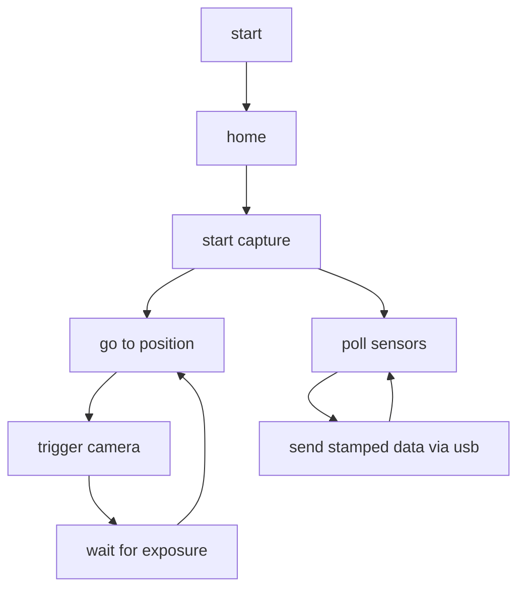

# periscope firmware

This is responsible for:
- motor pointing + feedback
- homing
- camera trigger
- precise time-marking (using gnss + PPS) of:
  - trigger events
  - imu data
  - temperature data

## Process

I am using Zephyr events to tell when to go between these states - and for each thread to know when to do what.